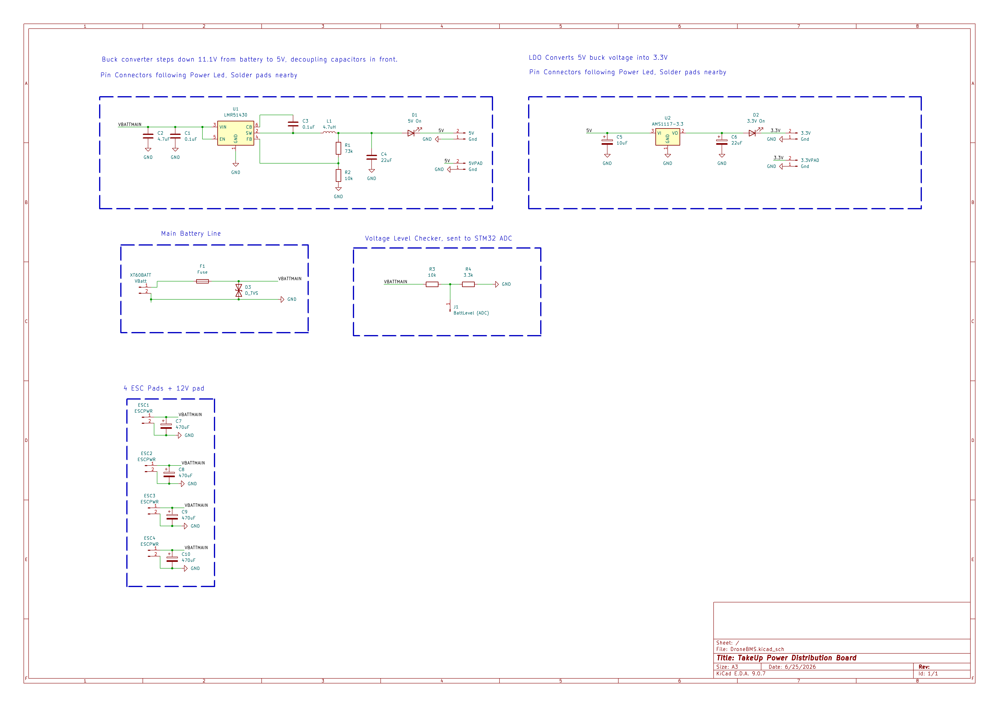

# TakeUp

**TakeUp** is a custom quadrotor flight stack built from scratch: a hand-wired STM32F4 flight controller, a self-etched power distribution board, a bit-banged NRF24L01+ radio link, and a from-scratch DShot150 ESC driver. The end goal is voice-controlled flight — commands transmitted over audio instead of a stick input — with the current build flying on a manual PS5-controller-over-RF link while the audio pipeline is developed.

> **Status: in progress.** Attitude estimation, the RF link, and standard PWM motor control are working. DShot150 and voice control are active work-in-progress (see [Known Limitations](#known-limitations--todo)).

---

## Table of Contents

- [System Overview](#system-overview)
- [Repository Layout](#repository-layout)
- [Flight Controller (STM32F4)](#flight-controller-stm32f4)
- [IMU / Attitude Estimation (MPU6050)](#imu--attitude-estimation-mpu6050)
- [Wireless Link (NRF24L01+)](#wireless-link-nrf24l01)
- [Motor Control](#motor-control)
- [Custom DShot150 Driver](#custom-dshot150-driver)
- [Power Distribution Board](#power-distribution-board)
- [Building the Firmware](#building-the-firmware)
- [Known Limitations / TODO](#known-limitations--todo)
- [License](#license)

---

## System Overview


Today, the RC packet source is a PS5 controller relayed through an ESP32 (`Software/Src/esp32.c`) rather than voice — this is the interim control path used to validate the flight controller, IMU fusion, and radio link while the voice front-end is built out.

---

## Repository Layout

```
TakeUp/
├── Hardware/
│   └── BMS/
│       ├── DroneBMS.kicad_sch     # power distribution board schematic (KiCad 9)
│       ├── DroneBMS.kicad_pcb     # 4-layer PCB layout
│       └── PCB_Render_1.png       # 3D render
│   └── Flight Controller/
│       └── IMG_4678.jpeg          # hand-soldered flight controller build
├── Software/
│   ├── INC/                       # headers
│   │   ├── Dshot150.h
│   │   ├── Motors.h
│   │   ├── Nrf2401.h
│   │   ├── mpu6050.h
│   │   └── main.h
│   └── Src/
│       ├── Dshot150.c              # custom DShot150 frame builder + DMA-PWM transmit
│       ├── Motors.c                # standard 1000-2000us PWM ESC control
│       ├── Nrf2401.c                # bare-register NRF24L01+ driver (no external RF24 lib)
│       ├── mpu6050.c                # IMU driver + complementary filter
│       ├── esp32.c                  # ESP32 transmitter sketch (PS5 controller → NRF24)
│       └── main.c                   # flight controller entry point / RX loop
└── image.png                        # power board schematic export
```

---

## Flight Controller (STM32F4)

The flight controller runs on an STM32F4 Nucleo-64 board (pin map matches the standard Nucleo layout: `PC13` user button, `PA5` = `LD2`). Firmware is generated with STM32CubeMX/HAL and hand-extended.


*Hand-wired prototype: MPU6050 breakout and NRF24L01+ (with SMA antenna) soldered onto perfboard with screw-terminal breakouts for power and signal.*

**Clock tree:** 8 MHz HSE → PLL (`M=4, N=72, P=/2`) → 72 MHz SYSCLK, APB1 = 36 MHz (72 MHz timer clock), APB2 = 72 MHz.

**Peripherals in use:**

| Peripheral | Role | Pins |
|---|---|---|
| `I2C1` | MPU6050 IMU, 100 kHz standard mode | `PB6` = SCL, `PB7` = SDA |
| `SPI2` | NRF24L01+ radio, mode 0, `fPCLK/2` | `PB14` = MISO, `PB15` = MOSI, `PC7` = SCK |
| — | NRF24 chip-select / chip-enable (bit-banged GPIO, not SPI NSS) | `PC0` = CSN, `PB0` = CE |
| `TIM2` (4ch) | ESC PWM / DShot output | `PA0` = CH1 (active), `PA1` = CH2, `PB10` = CH3, `PB2` = CH4 (configured, unused) |
| `USART2` | Debug/telemetry console, 115200 8N1 | `PA2` = TX, `PA3` = RX |

Boot sequence (`main.c`): GPIO → USART2 → I2C1 → SPI2 → TIM2 → arm ESC (`Motor_Init`) → bring up radio (`Nrf_init`) → enter RX loop, printing `BOOT`/`I2C OK`/`SPI OK`/`TIM OK` over UART at each stage so a bring-up failure is localized immediately from the serial log.

---

## IMU / Attitude Estimation (MPU6050)

`mpu6050.c` talks to the MPU6050 directly over `I2C1` (no external library) at address `0x68`.

**Init sequence:**

| Register | Value | Purpose |
|---|---|---|
| `0x75` (`WHO_AM_I`) | read, expect `0x68` | sanity check on boot |
| `0x6B` (`PWR_MGMT_1`) | `0x00` | wake from sleep, select internal clock |
| `0x1A` (`CONFIG`) | `0x01` | DLPF on, ~184 Hz bandwidth |
| `0x25` (`SMPLRT_DIV`) | `0x00` | sample rate = 1 kHz / (1 + 0) = 1 kHz |
| `0x1B` (`GYRO_CONFIG`) | `0b00011000` | ±2000 °/s full scale |
| `0x1C` (`ACCEL_CONFIG`) | `0x00` | ±16 g full scale |

Raw accel/gyro burst-reads come from `0x3B` (6 bytes, accel X/Y/Z) and `0x43` (6 bytes, gyro X/Y/Z), scaled by the datasheet sensitivity for the selected range (`/16384.0f` g/LSB for accel, `/16.4f` (°/s)/LSB for gyro).

**Gyro calibration** (`calibrate_gyro`) averages 1000 samples at boot to compute a static bias — currently computed but not yet subtracted from live readings (see [Known Limitations](#known-limitations--todo)).

**Attitude fusion** (`log_data`) runs a single-stage complementary filter:

1. Exponential low-pass (`ALPHA = 0.02`) on both accel and gyro channels.
2. Body-rate → Euler-rate transform: `phiHat_rps = gx + tan(theta)*(sin(phi)*gy + cos(phi)*gz)`, `thetaHat_rps = cos(phi)*gy - sin(phi)*gz`.
3. Gyro integration at `dt = 0.001 s` (1 kHz loop assumption) added to the running angle.
4. Fusion with accel-derived tilt (`atan`/`asin` off the gravity vector) at a 0.98 / 0.05 gyro/accel blend, printed over `USART2` as `Pitch:__, Roll:__`.

---

## Wireless Link (NRF24L01+)

Both ends of the radio link are custom drivers — the STM32 side (`Nrf2401.c`) talks directly to the NRF24L01+ command/register set over `SPI2` with no radio library, and the transmit side (`esp32.c`) uses the Arduino `RF24` library on an ESP32 paired to a PS5 controller over Bluetooth.

**Link configuration (must match on both ends):**

| Setting | Value |
|---|---|
| Data rate | 1 Mbps |
| RF channel | 85 (2.485 GHz) |
| TX power | 0 dBm |
| Address width | 5 bytes (`SETUP_AW = 0x03`) |
| RX/TX address | `E7 E7 E7 E7 E7` |
| Payload size | 16 bytes, static (no dynamic payloads) |
| Auto-ACK | disabled on both ends |
| CRC | 16-bit (ESP32 side); STM32 driver disables hardware auto-ack/CRC handling and relies on the fixed packet contract instead |

**Packet format** — a flat 16-byte struct sent as raw bytes:

```c
typedef struct {
    float throttle;
    float roll;
    float pitch;
    float yaw;
} rc_packet;   // 4 x 4-byte float = 16 bytes, matches NRF24 payload size exactly
```

**TX side** (`esp32.c`): reads PS5 gamepad stick axes via `ps5Controller`, maps left stick → throttle/roll and right stick → pitch/yaw, and pushes a packet over `RF24::write()` roughly every 20 ms.

**RX side** (`Nrf2401.c` + `main.c`): `Nrf_init()` powers up the radio, configures the RF settings above, and starts listening (`CE` high). `Recieve_nrf()` polls the `STATUS` register for the `RX_DR` flag, pulls the 16-byte payload with the `R_RX_PAYLOAD` command, and clears the flag. `main.c` copies the payload into an `rc_packet`, runs the throttle channel through a first-order low-pass (`alpha = 0.1`), and feeds the result to `Motor_SetSpeed()`.

Note: `enable_auto_ack()` exists in the driver but is not currently called from `Nrf_init()` — auto-ack stays disabled to match the transmitter's `setAutoAck(false)`.

---

## Motor Control

`Motors.c` drives ESCs with standard hobby PWM on `TIM2` channel 1: with the timer clocked at 1 MHz (72 MHz / (prescaler 71 + 1)) and a 20000-tick period, `CCR1` directly represents the pulse width in **microseconds** at a 50 Hz refresh rate — the same 1000–2000 µs framing every analog PWM ESC expects.

| Function | Behavior |
|---|---|
| `Motor_Init()` | Arms the ESC: full throttle (2000) for 2 s, then minimum (1000) for 2 s, matching the standard ESC calibration/arm beep sequence |
| `Motor_SetSpeed(percent)` | Maps 0–100 % linearly to 1000–2000 µs |
| `Motor_SetRaw(ccr)` | Direct CCR write for bench testing |
| `Motor_Stop()` | Forces minimum throttle (1000) |
| `Motor_Control_UART()` | Serial bench-test command parser (`S<pct>` set speed, `R<ccr>` set raw, `X` stop) over `USART2` |

Only `TIM2_CH1` is currently wired to a motor output in `main.c` — channels 2–4 are configured (see pin table above) but not yet driven, so multi-motor mixing isn't implemented yet.

---

## Custom DShot150 Driver

`Dshot150.c` implements the DShot150 digital ESC protocol frame-by-frame, from scratch, on top of `TIM2` + DMA.

**Frame construction is spec-correct.** A DShot frame is 16 bits: 11-bit throttle value, 1 telemetry-request bit, and a 4-bit CRC:

```c
data  = (throttle << 1) | telemetry;                  // 12 bits: 11-bit throttle + telemetry
crc   = (data ^ (data >> 4) ^ (data >> 8)) & 0xF;      // XOR-nibble checksum, per the DShot spec
frame = (data << 4) | crc;                             // final 16-bit frame
```

**Bit encoding.** Each of the 16 frame bits is expanded into a duty-cycle value for one PWM period — `170` (≈85% duty) for a `1` bit, `85` (≈42.5% duty) for a `0` bit — into a 17-entry buffer (16 bits + a trailing `0` to force the line low/reset). The buffer is streamed to `TIM2_CH1`'s `CCR1` register via `HAL_TIM_PWM_Start_DMA`, so each bit's duty cycle loads automatically without CPU intervention.

```c
void readBits(uint16_t data) {
    for (int i = 0; i < 16; i++) {
        uint16_t bitVal = (data >> (15 - i)) & 0x1;
        dshotbuffer[i] = bitVal ? 170 : 85;
    }
    dshotbuffer[16] = 0;
}
```

**Current state:** this correctly reproduces DShot's *bit encoding and checksum*, but the timer feeding it is still configured for the 20 ms / 1 MHz standard-PWM setup described above rather than a proper DShot150 bit clock (real DShot150 needs a ~6.67 µs bit period, i.e. the whole 16-bit frame takes ~107 µs — not 16 × 20 ms). Getting this fully protocol-compliant means giving `TIM2` a dedicated ARR/prescaler for DShot bit timing (or moving DShot to its own timer) and reworking the DMA burst length accordingly. This is the main piece marked "in progress" in this repo — see below.

---

## Power Distribution Board

`Hardware/BMS/DroneBMS.kicad_sch` — titled **"TakeUp Power Distribution Board"** in the schematic sheet — is a custom 4-layer (1.6 mm) PCB that takes a 3S LiPo in over an XT60 connector and produces the regulated rails and battery telemetry the flight controller needs. It's referred to informally as the "BMS" but its scope today is power conditioning + voltage sensing rather than active cell balancing.



**Power path:**

```
XT60 (3S, ~11.1V) → Fuse (F1) + TVS diode (D3, SMAJ15A) → VBATTMAIN
                                                              │
                              ┌───────────────────────────────┼───────────────────────────────┐
                              ▼                                ▼                               ▼
                    LMR51430 buck (U1)                4x ESC power pads                Battery-voltage
                    11.1V → 5V, 4.7uH inductor,        (raw VBATTMAIN + GND,            sense divider
                    73k/10k feedback divider           470uF bulk cap each)             (10k/3.3k → STM32 ADC)
                              │
                              ▼
                    AMS1117-3.3 LDO (U2)
                    5V → 3.3V logic rail
```

| Section | Components | Notes |
|---|---|---|
| Battery input | `XT60BATT1`, `F1` (fuse), `D3` (SMAJ15A TVS) | Overcurrent + transient surge protection on the main battery line before it fans out |
| 5V rail | `U1` LMR51430 synchronous buck, `L1` 4.7 µH, `R1`/`R2` = 73k/10k feedback, bulk + decoupling caps, `D1` "5V On" LED | Steps 11.1V pack voltage down to 5V |
| 3.3V rail | `U2` AMS1117-3.3 LDO, `D2` "3.3V On" LED | Steps 5V down to 3.3V for the MCU/logic |
| Battery sense | `R3`/`R4` = 10k/3.3k divider → `J1`/`J2` | Scales VBATTMAIN down into ADC range for the STM32 to read pack voltage in software |
| ESC power | `ESC1`–`ESC4` pads, 470 µF bulk cap each, plus a raw +12V pad | Distributes unregulated battery voltage directly to each ESC |

Board: 4 copper layers (`F.Cu`/`In1.Cu`/`In2.Cu`/`B.Cu`), 1.6 mm stack-up, 4 mounting holes, KiCad 9 source files included for both schematic and layout, plus a 3D render at `Hardware/BMS/PCB_Render_1.png`.

---

## Building the Firmware

The `Software/` tree is a standard STM32CubeIDE / STM32CubeMX HAL project targeting an STM32F4 Nucleo-64 board.

1. Import `Software/` into STM32CubeIDE (or point a Makefile-based ARM GCC toolchain at `Software/INC` and `Software/Src`).
2. Flash over the Nucleo's onboard ST-LINK.
3. Open a serial terminal at 115200 8N1 on the ST-LINK VCP to watch boot status (`BOOT`, `I2C OK`, `SPI OK`, `TIM OK`) and the live RC/attitude log.
4. Flash `Software/Src/esp32.c` to an ESP32 (Arduino core, `RF24` + `ps5Controller` libraries) to act as the transmitter, or drive `TIM2_CH1` directly via `Motor_Control_UART()` for a bench test with no radio at all.

---

## Known Limitations / TODO

- **Voice control isn't implemented yet.** The current transmit path is a PS5 controller relayed through an ESP32, standing in for the audio pipeline this project is ultimately meant to use.
- **Power board has no active cell balancing/protection IC** — today it's fusing, a TVS clamp, regulation, and voltage-divider telemetry, not a full smart BMS.

---

## License

MIT — see [LICENSE](LICENSE).
